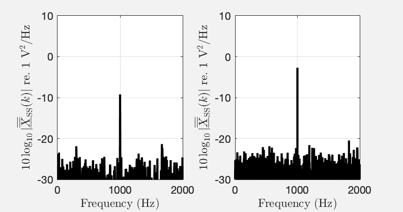

The MATLAB scripts in this folder recreate the figures from our paper 

> J. Ahrens, C. Andersson, P. Höstmad, W. Kropp, “Tutorial on Scaling of the Discrete Fourier Transform and the Implied Physical Units of the Spectra of Time-Discrete Signals,” 148th Convention of the AES, e-Brief 56, May 2020.

---

Script [fig_1_unscaled_magnitude_spectrum.m](fig_1_unscaled_magnitude_spectrum.m):

Fig 1: \\(\left\vert X(k)\right\vert\\) of a sine wave of frequency \\(f=1000\\) Hz and with amplitude \\(A=1\\) for \\(N=10^5\\) (left) and \\(N=2\cdot 10^5\\) (right).

---

Script [fig_2_single_sided_amplitude_spectrum_1.m](fig_2_single_sided_amplitude_spectrum_1.m):

Fig 2: Illustration of single-sided amplitude spectra. The upper plot depicts \\(x(n)\\), a sine wave of frequency \\(f=1000\\) Hz, with amplitude \\(A=1\\) V, and a DC of 1 V. The lower plot depicts \\(\left\vert \overline{X}_\text{SS}(k)\right\vert\\).

---

Script [fig_3_single_sided_amplitude_spectrum_2.m](fig_3_single_sided_amplitude_spectrum_2.m):

Fig. 3: Single-sided amplitude spectra \\(\left\vert \overline{X}_\text{SS}(k)\right\vert \\) on a logarithmic scale of a sine of amplitude 1 and implied unit V with additive white noise. \\(f_\text{s} = 100\\) kHz. Left: \\(N = 2\cdot 10^5\\). Right: \\(N = 2/8 \cdot 10^5\\).

---

Script [fig_4_power_density_spectrum.m](fig_4_power_density_spectrum.m):

Fig. 4: Single-sided power spectral density \\( \left\vert\underline{\overline{\overline{X}}}_\text{SS}(k)\right \vert\\) of the signal from Fig. 3 for different sampling frequencies \\(f_\text{s}\\) and lengths \\(N\\). Left: \\(f_\text{s} = 100\\) kHz, \\(N = 25000 \\). Right: \\(f_\text{s} = 12.5\\) kHz, \\(N = 12500\\).

