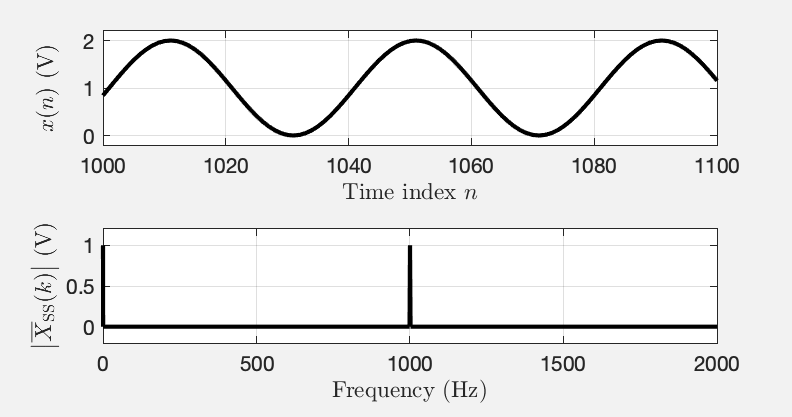

# Tutorial on Scaling of the Discrete Fourier Transform and the Implied Physical Units of the Spectra of Time-Discrete Signals

<b>Jens Ahrens, Carl Andersson, Patrik Höstmad, Wolfgang Kropp</b>

This text was originally presented as 

> Jens Ahrens, Carl Andersson, Patrik Höstmad, Wolfgang Kropp, “_Tutorial on Scaling of the Discrete Fourier Transform and the Implied Physical Units of the Spectra of Time-Discrete Signals_” in 148th Convention of the AES, e-Brief 56, May 2020 [ [pdf](http://www.soundfieldsynthesis.org/wp-content/uploads/pubs/Ahrens_etal_AES2020.pdf) ]. 

Please reference the text using this.

## Abstract
The combination of the time-discrete property of digital signals together with the commonly employed definition of the discrete Fourier transform (DFT) can cause ambiguity when interpreting magnitude spectra with respect to the physical unit of the signal under consideration. Standardized scaling of spectra increases the comparability of frequency-domain data that are published in scientific articles or data sheets of commercial products. We present and discuss in this tutorial a collection of the most relevant scaling options for DFT spectra to yield amplitude spectra, power spectra, and power density spectra, and we illustrate how an implied physical unit of the underlying signal is reflected by the magnitude of the spectrum. The tutorial is accompanied by Matlab/Octave scripts that demonstrate the different cases.

## 1  Introduction

The Fourier transform (FT) is one of the most common mathematical operations in acoustics and audio. Definitions for continuous signals (CFT) as well as for discrete signals (DFT) exist. When speaking of a discrete signal, we refer to a signal that exhibits a dependency on a discrete variable such as time or space. We assume the instantaneous amplitude of the signal to be known with infinite accuracy. 

Discrete signals require a somewhat different treatment than continuous ones because discrete signals are not physical. One aspect with which this becomes evident is interpreting the magnitude of the spectrum of a discrete signal, which is greatly facilitated when the spectrum is scaled. Although the scaling methods that we present here are widely known, we are not aware of a compact resource that summarizes the important information in an educational manner. This tutorial aims at filling this gap. Our treatment will be simplifying in a latent manner in the sense that we leave out certain less tangible details of the matter and focus on the fundamental concepts. We refer the reader to the references based on which we compiled this tutorial [[1](#[1])], [[2](#[2]), Sec. 4.2] [[3](#[3]), Ch. 4], [[4](#[4]), Ch. 6] and to the supplementary materials that we provide \cite{github_scaling}. For ease of compactness, we omit stating proofs.

After a brief excursion to the CFT in Sec. [2](#sec:cft), scaling options for the DFT are presented in Sec. [3.1](#sec:scaling_tones) and [3.2](#sec:scaling_broadband). Sec. [3.3](sec:single-sided) introduces the concept single-sided spectra, which the scaling approach requires to produce a representation of the spectrum that can be interpreted conveniently. Examples are presented. Further aspects are discussed in Sec. [4](#sec:windowing) and [5](#sec:closing_remarks).

## 2  The Continuous Fourier Transform

We assume the following definition of the CFT:

$$
\tag{1} \label{eq:cft}
    X(\omega) = \int_{-\infty}^{\infty} x(t) \ {\mathrm e}^{-{\mathrm i} \omega t} dt
$$

$$x(t)$$ is a purely real signal that is dependent on time, $$\omega = 2\pi f$$ is the angular frequency, $$f$$ is the frequency in $$\mathrm{Hz}=\mathrm{s}^{-1}$$, and $$t$$ is time in $$\mathrm{s}$$. $$X(\omega)$$ is termed the spectrum of $$x(t)$$. Note that above example represents a CFT over time. CFT over space exists, too [[5](#[5])].

Let us assume that $$x(t)$$ in \eqref{eq:cft} represents a microphone signal in V. In terms of the units, the complex exponential is dimensionless (i.e., it has unit 1, or no unit in other words), and it is easy to show that integration over $$t$$ results in multiplying with s, the unit of $$t$$. The spectrum $$X(\omega)$$ is therefore given in the unit of

$$
\tag{2}
[X(\omega)] = \text{V} \cdot \text{s} = \frac{\text{V}}{\text{Hz}} \, .
$$

$$X(\omega)$$ therefore represents an amplitude density, i.e. amplitude per frequency interval. 

## 3  The Discrete Fourier Transform

Interpretation of the spectrum of the DFT in terms of the units is not as straightforward as with the CFT. We assume the following definition of the DFT in this tutorial:

$$
\tag{3}\label{eq:dft}
    X(k) = \sum_{n=0}^{N-1} x(n) \ {\mathrm e}^{-{\mathrm i} \frac{2\pi k}{N}n}
$$

$$x(n)$$ is a signal that is dependent on the integer time index $$n$$. One also speaks of $$x(n)$$ as the signal at _tap_ $$n$$. $$k$$ is the integer frequency index also known as _bin_. Other definitions exist that differ only with respect to a normalization constant and/or the sign of the exponent. Eq. \eqref{eq:dft} appears to be the most widely used definition of the DFT and is also used by MATLAB and Python.

### 3.1  Scaling of DFT Spectra of Discrete Tones

A continuous signal $$x(t)$$ that is composed of discrete tones is characterized primarily by the amplitude and phase of each of the tones. A first property of $$X(k)$$ that we notice is that $$\vert X(k)\vert $$ is directly proportional to $$N$$, which is undesired in most situations (cf. Fig. [1](#fig1)). It is preferable to scale the spectrum such that the amplitudes of said tones are apparent. Compensating for the total number of samples as

$$
\tag{4}\label{eq:amplitude_spectrum}
\overline{X}(k) = \frac{1}{N} X(k)
$$

yields an _amplitude spectrum_, i.e. a spectrum $$X(\omega)$$ whose implied unit[^1] is the implied unit of $$x(n)$$. Refer to Fig. [2](#fig2) and [3](#fig3) in Sec. [3.3](#sec:single-sided) for examples of amplitude spectra. 

   Fig. 1: $$\vert X(k)\vert $$ of a sine wave of frequency $$f=1000~\mathrm{Hz}$$ and with amplitude $$A=1$$ for $$N=1\cdot 10^5$$ (left) and $$N=2\cdot 10^5$$ (right)[^2]. The horizontal axis was converted from bin index $$k$$ to frequency in Hz as explained in Appendix [A](#sec:k). See [this](fig_1_unscaled_magnitude_spectrum.m) MATLAB script.

The square of this spectrum constitutes a _power spectrum_, 
$$
\tag{5}\label{eq:power_spectrum}
\overline{\overline{X}}(k) = \vert\overline{X}(k)\vert^2 = \frac{1}{N^2} \vert X(k)\vert^2
$$

the values of which are directly proportional to the power in each bin $$k$$ [^3]. This means that the power of each of the discrete tones in a signal is represented by $$\overline{\overline{X}}(k)$$ (if the energy of each discrete tone is confined to one bin). Assuming the implied unit of $$x(t)$$ is $$\mathrm{V}$$, then the implied unit of $$\overline{\overline{X}}(k)$$ is $$\mathrm{V}^2$$. 

[^1]: We speak of an implied unit as, strictly speaking, discrete signals do not have a physical unit. If $$x(n)$$ is the discrete representation of a physical signal $$x(t)$$, then we consider $$[x(t)]$$, the unit of $$x(t)$$, the _implied unit_ of $$x(n)$$.
[^2]: Note that magnitude spectra are typically plotted on a logarithmic scale, i.e. $$20\log_{10}\vert X(k)\vert $$ when representing amplitude or $$10\log_{10}\vert X(k)\vert$$ when representing power or energy. We chose a linear scale here for ease of demonstration.
[^3]: With electrical signals, the power $$P$$ is obtained as $$P=U^2/R$$, with $$U$$ being the effective (RMS) voltage and $$R$$ being a resistance. The RMS spectrum $$\overline{X}_\text{RMS}(k)$$ is defined in \eqref{eq:rms_spectrum}, and its square is directly proportional to $$\overline{\overline{X}}(k)$$ via \eqref{eq:single-sided}.

### 3.2  Scaling of DFT Spectra of Broadband Signals

As we will demonstrate in Sec. [3.3](#sec:single-sided), for a continuous signal $$x(t)$$ that can be described as a broadband stochastic signal of some frequency distribution and power rather than an amplitude, it can be favorable to adapt the scaling.

The most important alternative to amplitude and power spectra is the _power spectral density_ (PSD) or _power density spectrum_

$$
\tag{6}\label{eq:power_spectral_density}
\underline{\overline{\overline{X}}}(k) = \frac{N}{f_\text{s}} \overline{\overline{X}}(k) = \frac{N}{f_\text{s}}\vert\overline{X}(k)\vert^2 = \frac{1}{f_\text{s} N} \vert X(k)\vert^2
$$

with the implied unit $$\mathrm{V}^2/\mathrm{Hz}$$. The PSD is the power spectrum \eqref{eq:power_spectrum} divided by the frequency resolution $$f_\text{s}/N$$. Consider a continuous broadband signal that is sampled at different sample rates but with the same number of samples. At a lower sample rate, each bin represents a narrower frequency band so that the magnitude of the power spectrum will be lower. The PSD compensates for this.

It is also possible to create an amplitude density spectrum like \eqref{eq:cft}. However, the usefulness of this with discrete signals is not obvious.

### 3.3  Single-Sided and Double-Sided Spectra

When computing $$X(k)$$ in \eqref{eq:dft} for a sufficient range of $$k$$, one finds that $$X(k)$$ is periodic with a period equal to the length $$N$$ of the signal $$x(n)$$. When $$x(n)$$ is purely real - as it is the case with most audio-related scenarios - then $$X(k)$$ exhibits certain symmetries with respect to $$k$$ that allow for concluding that some of the values of $$X(k)$$ inside one period are redundant and may be removed from the representation. 

It is helpful in many situations -- such as the context of this paper -- to convert the (symmetric) double-sided spectrum, i.e., $$X(k)$$ for a given range of length $$N$$ of $$k$$ to a single-sided spectrum $$X_\text{SS}(k)$$ that contains only non-redundant values. To account for the change of representation through omitting non-redundant values, we multiply all values of $$X(k)$$ that represent a pair of a value of $$X(k)$$ as well as a redundant value by 2. 

Let us assume in the following a spectrum $$X(k)$$ of a purely-real signal $$x(n)$$ of even length $$N$$. The symmetry is summarized as

$$
\tag{7}
X(k) = X(-k)^* \ \ \ \forall \ 0 < k < \frac{N}{2} \ .
$$

The asterisk $$^*$$ denotes complex conjugation. The direct current (DC) bin ($$k=0$$) and the bin at $$k=N/2$$, i.e., the bin that corresponds to the Nyquist frequency (cf. Appendix [A](#sec:k), are purely real and unique. 

We therefore define the single-sided spectrum $$X_\text{SS}(k)$$ as

$$
\tag{8}\label{eq:single-sided}
    X_\text{SS}(k) = \begin{cases}
    \ \ \ \ \, X(k) \ \ \ \forall k = 0\\
    2 \cdot  X(k) \ \ \ \forall 0 < k < \frac{N}{2} \ \ \ \ . \\
    \ \ \ \ \, X(k) \ \ \ \forall k = \frac{N}{2}
    \end{cases}
$$

Note that for odd $$N$$, all bins other than $$k=0$$ have to be multiplied with 2. The single-sided representations of $$\overline{X}(k)$$, $$\underline{\overline{X}}(k)$$, $$\overline{\overline{X}}(k)$$, and $$\underline{\overline{\overline{X}}}(k)$$ are obtained equivalently to \eqref{eq:single-sided}. 

To highlight the usefulness of the single-sided representation, Fig. [2](#fig2) depicts the single-sided amplitude spectrum $$\vert \overline{X}_\text{SS}(k)\vert $$ (cf. \eqref{eq:amplitude_spectrum}) of a signal $$x(n)$$ that represents a pure sine wave with amplitude $$1~\mathrm{V}$$ and an amplitude offset (DC) of $$1~\mathrm{V}$$. The amplitude of the sine wave as well as and the DC can be directly deduced from $$\vert \overline{X}_\text{SS}(k)\vert $$.

   Fig. 2: Illustration of single-sided amplitude spectra. The upper plot depicts $$x(n)$$, a sine wave of frequency $$f=1000$$ Hz, with amplitude $$A=1~\mathrm{V}$$, and a DC of $$1~\mathrm{V}$$. The lower plot depicts $$\vert \overline{X}_\text{SS}(k)\vert $$. See [this](fig_2_single_sided_amplitude_spectrum_1.m) MATLAB script.

However, the picture is very different when interpreting amplitude spectra of broadband signals as illustrated in Fig. [3](#fig3). The spectrum of a sine wave with additive noise is depicted for two different lengths $$N$$ of the DFT. The magnitude of the sine wave is independent of $$N$$ while the magnitude of the noise changes with $$N$$.

   Fig. 3: Single-sided amplitude spectra $$\vert \overline{X}_\text{SS}(k)\vert $$ on a logarithmic scale of a sine of amplitude 1 and implied unit $$\mathrm{V}$$ with additive white noise. $$f_\text{s} = 100~\mathrm{kHz}$$. Left: $$N = 2\cdot 10^5$$. Right: $$N = 2/8 \cdot 10^5$$. See [this](fig_3_single_sided_amplitude_spectrum_2.m) MATLAB script.

When the analysis of the noise in the signal from Fig. [3](#fig3) is of interest, a power density scaling is more favorable. Fig. [4](#fig4) presents the single-sided power density spectrum $$\underline{\overline{\overline{X}}}_\text{SS}(k)$$ of the signal from Fig. [3](#fig3) for different sampling frequencies $$f_\text{s}$$ and different lengths $$N$$. Contrary to the amplitude spectrum in Fig. [3](#fig3), the magnitude of the noise is independent of $$f_\text{s}$$ and $$N$$. However, the magnitude of the discrete tone changes. This is a fundamental dilemma that cannot be avoided. The reason for this is that the concept of a spectral density is not meaningful for discrete tones (and the concept of a spectral amplitude is most of the times not meaningful for broadband signals). 

   Fig. 4: Single-sided power spectral density $$\vert \underline{\overline{\overline{X}}}_\text{SS}(k)\vert $$ of the signal from Fig. [3](#fig3) for different sampling frequencies $$f_\text{s}$$ and lengths $$N$$. Left: $$f_\text{s} = 100~\mathrm{kHz}$$, $$N = 25000$$. Right: $$f_\text{s} = 12.5~\mathrm{kHz}$$, $$N = 12500$$. See [this](fig_4_power_density_spectrum.m) MATLAB script.

Note that while $$\overline{\overline{X}}(k) = \vert \overline{X}(k)\vert^2$$ (Eq. \eqref{eq:power_spectrum}) holds for double-sided power spectra, this relation reads

$$
\tag{9}
\overline{\overline{X}}_\text{SS}(k) = 
    \begin{cases}
    \frac{1}{2} \vert\overline{X}_\text{SS}(k)\vert^2 
    \quad\forall 0 < k < \frac{N}{2}\\
    \ \ \, \vert\overline{X}_\text{SS}(k)\vert^2 
    \quad\forall k =0, k = \frac{N}{2} 
    \end{cases}
$$

for single-sided spectra (and similarly for the PSD). This can be interpreted in terms of the crest factor of sine waves of $$\sqrt{2}$$, i.e., the ratio of maximum value (in the case of sine waves the amplitude) to root-mean-square (RMS, cf. App. [B](#sec:rms). For $$0 < k < \frac{N}{2}$$, the RMS of the signal at each bin is obtained by dividing the magnitude of the amplitude spectrum by $$\sqrt{2}$$ as the basis functions of the DFT may be interpreted as sine waves:

$$
\tag{10}\label{eq:rms_spectrum}
    \overline{X}_\text{RMS}(k) = \begin{cases}
    \frac{1}{\sqrt{2}}\overline{X}_\text{SS}(k) 
    \quad \forall 0 < k < \frac{N}{2} \\
    \ \ \ \ \ \overline{X}_\text{SS}(k) 
    \quad\forall k =0, k = \frac{N}{2}
    \end{cases} \ \ .
$$

We term $$\overline{X}_\text{RMS}(k)$$ _RMS spectrum_. It represents the RMS amplitudes of the discrete tones in the signal, and $$\overline{\overline{X}}_\text{SS}(k) = \vert \overline{X}_\text{RMS}(k)\vert^2$$ holds. A similar definition can be established for an RMS density spectrum $$\underline{\overline{X}}_\text{RMS}(k)$$. Note that RMS-spectra are inherently single sided and have no equivalent double-sided representation.

## 4  Windowing

It is common in spectral analysis of discrete signals to apply a window $$w(n)$$ to the signal before the DFT in \eqref{eq:dft}. This needs to be taken into account in the scaling of the spectra, which has be performed differently for tonal signals as in Sec. [3.1](#sec:scaling_tones) and for broadband signals as in Sec. [3.2](#sec:scaling_broadband):

$$
\begin{align}
\tag{11}\label{eq:window_scaling_1}
    \overline{X}_w(k) &= \frac{1}{\sum_n w(n)} X_w(k)  \\ \tag{12}\label{eq:window_scaling_3}
    \overline{\overline{X}}_w(k) &= \frac{1}{(\sum_n w(n))^2} \vert X_w(k)\vert^2 \\ \tag{13}\label{eq:window_scaling_4}
    \underline{\overline{\overline{X}}}_w(k) &= \frac{1}{f_\text{s} \sum_n w^2(n)} \vert X_w(k)\vert^2
\end{align}
$$

where $$X_w(k)$$ is the DFT of $$x(n)\cdot w(n)$$. Simply put, the factors $$N$$ in \eqref{eq:amplitude_spectrum} and \eqref{eq:power_spectrum} are replaced by the sum $$\sum_n w(n)$$ of the window samples, and the factor $$N$$ in the last equality in \eqref{eq:power_spectral_density} is replaced by the sum $$\sum_n w^2(n)$$ of the squared window samples. Eq. \eqref{eq:window_scaling_1} simplifies to \eqref{eq:amplitude_spectrum} for the case of $$w(n) = 1$$, \eqref{eq:window_scaling_3} to \eqref{eq:power_spectrum}, and \eqref{eq:window_scaling_4} to \eqref{eq:power_spectral_density}.

## 5  Other Remarks

A complex number $$z$$ may be represented either as real and imaginary parts $$\Re\{z\}$$ and $$\Im\{z\}$$ or as magnitude $$\vert z\vert$$ and phase $$\angle z$$ as

$$
\tag{14}
z = \Re\{z\} + {\mathrm i} \Im\{z\} = \vert z\vert \cdot {\mathrm e}^{ {\mathrm i} \angle z} \ .
$$

Since the complex exponential is dimensionless, $$\Re\{z\}$$, $$\Im\{z\}$$, and $$\vert z\vert$$ carry the same physical unit that is determined from the type of spectrum that $$z$$ is part of.

The transfer function $$H(k)$$ of a system can be represented as the ratio of output and input spectra as $$H(k) = Y(k) / X(k)$$. Any scaling of $$Y(k)$$ and $$X(k)$$ will cancel out. Regarding the units, $$[H(k)] = [Y(k)] / [X(k)]$$ holds so that $$H(k)$$ is dimensionless if $$[Y(k)] = [X(k)]$$. Similar considerations hold of the impulse response. Note that the magnitude of the unscaled spectrum of an impulse with amplitude 1 is always 1 independent of $$N$$.

## 6  Conclusions

The combination of scaling and the single-sided representation of the DFT spectra of purely real signals allow for spectral representations like amplitude spectra, power spectra, and power density spectra of discrete signals that can be conveniently interpreted in terms of the implied physical units. Different scaling is required for discrete tones and for stochastic signals to make the scaled magnitude spectrum of one of the two signal types independent of the length of the Fourier transform and the sampling frequency. This causes a fundamental dilemma when analysing signals that contain both types of elementary signals. 

## APPENDICES

### A  The Relation Between Bin Index and Frequency

When taking the into account with what frequency $$f_\text{s}$$ a previously time-continuous signal was sampled, then it is possible to relate the bin index $$k$$ in \eqref{eq:dft} to a frequency $$f(k)$$ in Hz that represents the center frequency of the bin as

$$
\tag{15}\label{eq:k}
    f(k) = \frac{k}{N}\cdot f_\text{s}  \ \ \ \forall \ 0 \leq k \leq N/2 \, .
$$

Eq. \eqref{eq:k} was used in all figures in this paper that depict spectra to express the horizontal axis in Hz.

### B  Root Mean Square

The RMS $$x_\text{RMS}$$ of a discrete time domain signal $$x(n)$$ is given by

$$
\tag{16}\label{eq:rms_t}
    x_\text{RMS}=\sqrt{\frac{1}{N}\sum_{n=0}^{N-1} \vert x(n)\vert^2} \ .
$$

Inserting Parseval's theorem given by

$$
\tag{17}\label{eq:parseval}
    \sum_{n=0}^{N-1}  \vert x(n)\vert^2 = \frac{1}{N} \sum_{k=0}^{N-1} \vert X(k)\vert^2
$$

into \eqref{eq:rms_t} allows for computing the RMS from the spectrum $$X(k)$$ as

$$
\tag{18}\label{eq:rms_f}
    x_\text{RMS}=\sqrt{\frac{1}{N^2}\sum_{n=0}^{N-1} \vert X(k)\vert^2} \ \ .
$$

## References

1. G. Heinzel, A. Rüdiger, R. Schilling. Spectrum and spectral density estimation by the Discrete Fourier transform (DFT), including a comprehensive list of window functions and some new flat-top windows. Tech. Rep. [http://hdl.handle.net/11858/00-001M-0000-0013-557A-5](http://hdl.handle.net/11858/00-001M-0000-0013-557A-5), 2002.
2. J. G. Proakis and D. G. Manolakis. *Digital Signal Processing: Principles Algorithms and Applications*. Prentice-Hall, Upper Saddle River, New Jersey, USA, 3rd edition, 1996.
3. L. Tan and J. Jiang. *Digital Signal Processing: Fundamentals and Applications*. Academic Press, Amsterdam, The Netherlands, 2nd edition, 2013.
4. D. C. Swanson. *Signal Processing for Intelligent Sensor Systems with MATLAB*. CRC Press, London, UK, 2017.
5. E. Williams. *Fourier Acoustics: Sound Radiation and Nearfield Acoustical Holography*. Academic Press, New York, 1999.

