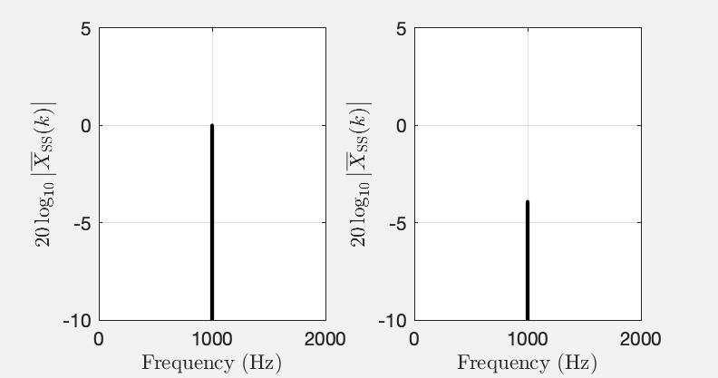
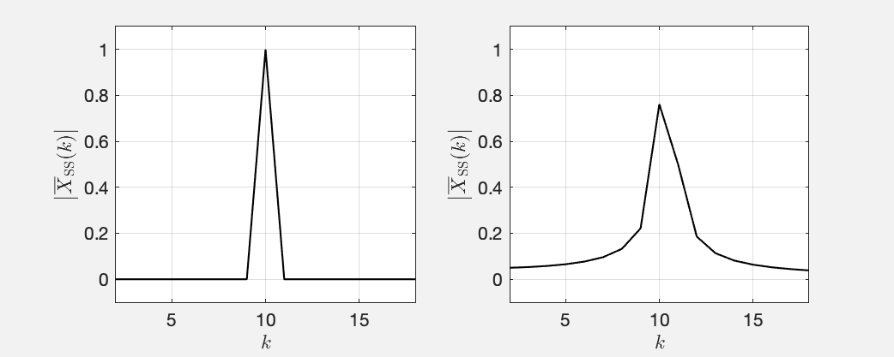
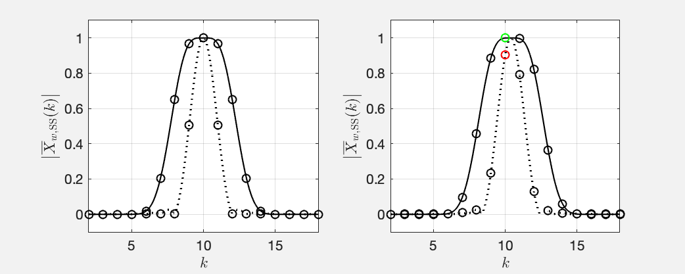

# Some Notes on Windows in Spectral Analysis

<b>Jens Ahrens</b>

v. 2020-05-25

Please cite this document as 

> Jens Ahrens, "Some Notes on Windows in Spectral Analysis," Tech. Report, Chalmers Univeristy of Technology, 2020.

## Abstract

The following plots show the (unwindowed) single-sided Discrete Fourier Transform (DFT) amplitude spectra $$\vert \overline{X}_\text{SS}(k)\vert $$ of two sine waves of amplitude $$1$$. (Refer to [this article](https://appliedacousticschalmers.github.io/scaling-of-the-dft/AES2020_eBrief/) if you are unsure about what a single-sided amplitude spectrum is.)

   Fig. 1: Single-sided DFT amplitude spectra $$\vert \overline{X}_\text{SS}(k)\vert $$ of two sine waves of amplitude $$1$$ and frequency  $$1000~\mathrm{Hz}$$ (left) and $$1002.5~\mathrm{Hz}$$. The horizontal axis was converted from bin index $$k$$ to frequency in $$\mathrm{Hz}$$ as explained [here](https://appliedacousticschalmers.github.io/scaling-of-the-dft/AES2020_eBrief/README.md#sec:k).

Both sines were sampled at $$f_\textrm{s} = 10^5$$ Hz, and the length of the DFT was $$N = 2\cdot 10^5$$ in both cases. So, the only difference is the frequencies. Yet, the spectra suggest that the sines differ in amplitude by more than $$3~\textrm{dB}$$. This article clarifies why this is and how this apparent difference can be avoided using flat top windows. 

## Main Lobes and Side Lobes of Windows Revisited

Let's look at the single-sided amplitude spectra $$\vert \overline{X}_\text{SS}(k)\vert $$ of two sine waves with a DFT length of $$N=101$$. See [this MATLAB script](main_lobes_rect.m). 

   Fig. 2: Single-sided amplitude spectra $$\vert \overline{X}_\text{SS}(k)\vert $$ of two sines with a frequency that is equivalent to bin index $$k=10$$ (left) and $$k=10.4$$ (right).

These plots were obtained by connecting all spectral magnitudes that occur at integer $$k$$ with straight lines. This is how magnitude spectra are usually plotted. Note that on the left hand side, the magnitude is $$0$$ at all values of $$k$$ other than $$k=10$$, which is the frequency of the sine. As you may know, all windows including the rectangular window that is implied here, exhibit a main lobe and side lobes which cause smearing of the spectrum. Why can't we see any of this in the left hand plot in Fig. [2](#fig2)?

The short answer is: The left hand plot in Fig. [2](#fig2) is a special case where the frequency of the sine whose spectrum we are looking at corresponds to one of the basis functions of the DFT (some may call this "It is exactly in the center of a bin $$k$$."). 

Recall the definition of the DFT:
$$
\tag{1}\label{eq:dft}
    X(k) = \sum_{n=0}^{N-1} x(n) \ {\mathrm e}^{-{\mathrm i} \frac{2\pi k}{N}n}
$$
It happens so that if the frequency of a sine is exactly in the center of a bin $$k_0$$ of the DFT $\eqref{eq:dft}$, there will be a complex exponential $${\mathrm e}^{-{\mathrm i} \frac{2\pi k}{N}n}$$ that will oscillate at the exact same frequency like the sine. In other words, we need only this single basis function (plus the one at $$-k_0$$) of the DFT to represent the sine. The spectral coefficients $$X(k)$$ will be zero for all other $$k$$.

Ok, so far so good. How can we bring the lobes into the game? Usually, the DFT $\eqref{eq:dft}$ is only computed for integer $$k$$ because this covers all of the information. You can actually also evaluate $\eqref{eq:dft}$ for fractional $$k$$ as the spectrum of a time-discrete signal is contiuous[^1]. There is nothing that prevents us from doing this. See [this MATLAB script](main_lobes_rect.m), which produces the following Fig. [3](#fig3), which is identical to Fig. [2](#fig2) but with the DFT $\eqref{eq:dft}$ evaluated also for fractional $$k$$ (gray line). 

   Fig. 3: Same like Fig. [2](#fig2) but with the DFT evaluated also at fractional $$k$$.

The black circles mark the spectral points at integer $$k$$. That's the same data points that Fig. [2](#fig2) comprises, and that's the ones that we usually look at. You can now actually discern the window lobes in the gray lines! It just happens so that for this particular case, the DFT "samples" the window only at the maximum of the main lobe and exactly at the zeros between the lobes. Note that the circumstance that the integer bins sample the window exactly at the zeros between lobes is a particularity of the reactangular window. You will always see traces of the side lobes for any other window. 

The story changes if we look at sines with arbitrary frequency, for example equivalent to $$k=10.4$$. See the right hand plot in Fig. [3](#fig3) , which is a variant of Fig. [2](#fig2) (right) and also plots fractional $$k$$. The DFT does indeed sample the window lobes outside of the zeros between the lobes so that we notice them. It happens so that the main lobe is not sampled at its maximum so that the sine amplitude that we read from the amplitude spectrum is misleading. This is where flat top windows come into play.

[^1]: The discrete signal can take on any arbirtary frequency within the limits of the Nyquist-Shannon theorem. 

## Flat Top Windows

The following figure plots a flat top window [[1](#[1])] in the domain of the original signal $$x(n)$$ (some call this the time domain). See this [MATLAB script](flat_top_window_time_domain.m).

   Fig. 4: The standard flat top window that MATLAB uses for $$N=101$$

Fig. [5](#fig5) depicts the amplitude spectra of the same scenario like in Fig. [2](#fig2) and [3](#fig3)  (sine waves with frequencies equivalent to $$k=10$$ and $$k=10.4$$) but with a Hann window[^2] and a flat top window applied before the DFT[^3]. See [this MATLAB script](main_lobes_flat_top.m). We chose the Hann window for completeness. The story is very similiar like for the rectangular window discussed above. 

   Fig. 5: Same like Fig. [3](#fig3) but with a Hann window (dotted line) and a flat top window (solid line) applied.

The main lobe of the Hann window is pointy so that it is not guaranteed that the DFT samples its maximum (cf. Fig. [5](#fig5) (right)). The main lobe of the flat top window has a flat top (surprise!) with ripples of less than $$0.1~\textrm{dB}$$ and that is a least one bin wide. It is therefore guaranteed that that DFT samples the main lobe around its maximum (green circle in Fig. [5](#fig5) (right)) so that we obtain approximately the same magnitude independent of the frequency of the sine.

The price that we pay is that the width of the main lobe obscures the precise frequency of the sine that we analyse even more than it occurs for other windows. We know the sine's amplitude more precisely but lose precision of its frequency. Greetings from Heisenberg! 

In order to determine both frequency and magnitude with precision requires either a DFT with integer $$k$$, which is not commonly applied because of the computational cost, or interpolation of the DFT magnitude spectrum as proposed, for example, in [[2](#[2])]. Either way, you have to hope that the frequency of the sine that you analyse is constant during the length of the DFT. More greetings from Heisenberg.

Note that it happens so that the side lobes of both the Hann window and the flat top window are so low in magnitude that they are not visible in Fig. [5](#fig5) (left) because the magnitude is plotted on a linear scale. Feel free to play around with the MATLAB script and switch the plotting to logarithmic see the side lobes even at integer $$k$$.

To close the loop, we're getting back to the example from Fig. [1](#fig1) in the Abstract but apply a flat top window (see [this MATLAB script](flat_top_window_applied.m)):

   Fig. 6: XXX

No matter what the frequency of the sine is, we can deduce that its amplitude is $$0$$ dB or equivalently $$1$$. Recall that we are looking at [single-sided amplitude spectra](https://appliedacousticschalmers.github.io/scaling-of-the-dft/AES2020_eBrief/).

[^2]: Note that it is _Hann_ not _Hanning_ (it was named after Julius von Hann). There is indeed a _Hamming_ window, which was named after Richard Hamming.
[^3]: Note that many different flat top windows exist [[1](#[1])].

## Conclusions

Use a flat top window to determine the amplitudes of stationary oscillations in a signal. Do not use it if you need to deduce the frequencies of the oscillations.

# References

1. G. Heinzel, A. Rüdiger, R. Schilling. Spectrum and spectral density estimation by the Discrete Fourier transform (DFT), including a comprehensive list of window functions and some new flat-top windows. Tech. Rep. [http://hdl.handle.net/11858/00-001M-0000-0013-557A-5](http://hdl.handle.net/11858/00-001M-0000-0013-557A-5), 2002.

2. J. Smith and X. Serra, "PARSHL: An analysis/synthesis program for nonharmonic sounds based on a sinusoidal representation,” in Proc. of the Int. Computer Music Conf. (ICMC), Champaign/Urbana, Illinois, USA, Aug. 1987.